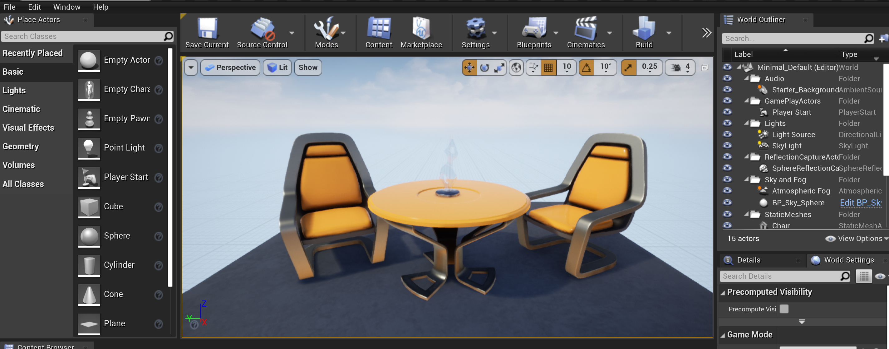
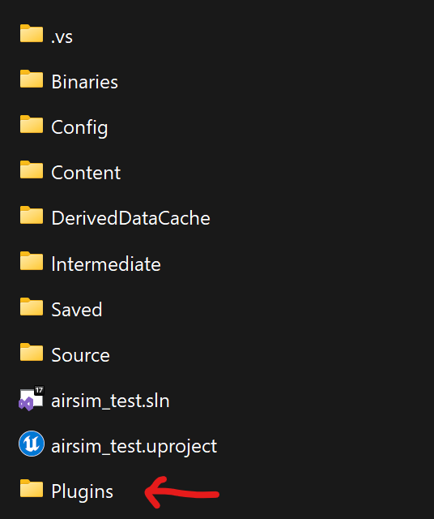
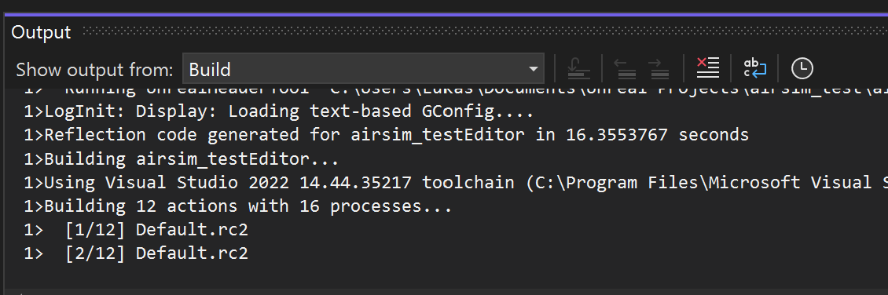
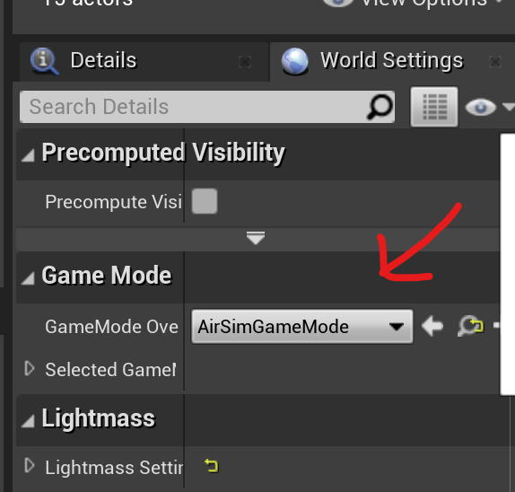
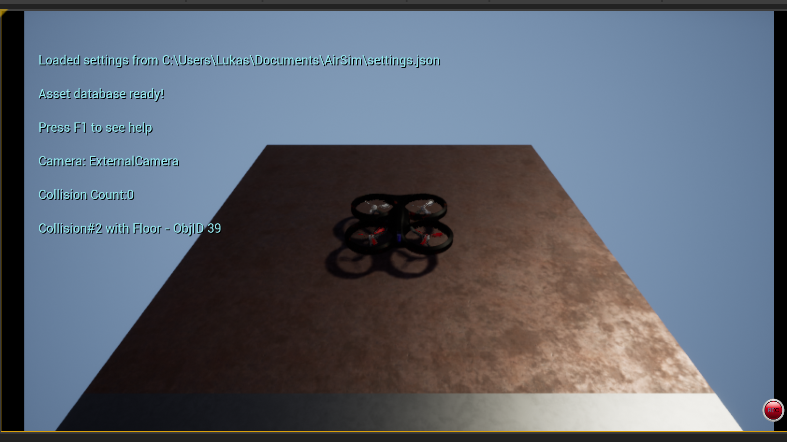

# Getting Started

### 🛠️ Libraries & Tools

- [Stable Baselines 3](https://github.com/DLR-RM/stable-baselines3)
- [OpenAI - Gym](https://github.com/openai/gym)
- [Microsoft AirSim](https://github.com/microsoft/AirSim)
- [Unreal Engine 4.27.2](https://www.unrealengine.com/en-US/)
- [Visual Studio 2022](https://visualstudio.microsoft.com/thank-you-downloading-visual-studio/?sku=Community&channel=Release&version=VS2022&source=VSLandingPage&cid=2030&passive=false)

Important Note : You have to downloand `Unreal Engine 4.27.2` using `Epic Launcher`

### 👷 Build AirSim on Windows# ###
1. To run `AirSim` correctly, you need to make sure to select Desktop Development with C++ and Windows 10 SDK 10.0.19041 (should be selected by default) and select the latest .NET Framework SDK under the 'Individual Components' tab while installing VS 2022 as shown below

- ✅ Desktop development with C++
- ✅ .NET Framework 4.8.1 SDK
- ✅ Windows 10 SDK 10.0.19041 

2. Start Developer Command Prompt for VS 2022 by invoking the `terminal`
3. Clone the repo: `git clone https://github.com/Microsoft/AirSim.git`, and go the AirSim directory by cd AirSim.
4. Run `build.cmd` from the command line. This will create ready to use plugin bits in the `Unreal\Plugins` folder that can be dropped into any Unreal project.

### 🔨 Build Unreal Project #### 
1. To build 1st project, we can use blank template.
2. Open `Epic Launcher` and launch `Unreal Engine 4.27.2`. 
3. Under `New project Categories` Select `Games` and Press `Next`, select `Blank` and select `Blueprint`.
4. You can rename your project name to any, for example `airsim_test` and it's default saved to `Documents\Unreal Projects`. 
5. Click `Create Project`. 
6. This will later launch below `view`

7. From the File menu select New `C++ class`, leave default `None` on the type of class, click `Next`, leave default name `MyClass`, and click `Create Class`. We need to do this because Unreal requires at least one source file in project. It should trigger compile and open up Visual Studio solution.
8. This invoke a `Compiling new C++ code` progress. This can take 1-2 minutes.
9. If successful, it'll launch `Visual Studio 2022`. No changes needed on `MyClass.cpp`. 
10. Go to AirSim folder that is generated from `4` and copy `Unreal\Plugins` folder into `\Documents\Unreal Projects\airsim_test` and you should see the following



11. Edit the `airsim_test.uproject` and add the following to support our `plugin`.
```
{
	"FileVersion": 3,
	"EngineAssociation": "4.27",
	"Category": "",
	"Description": "",
	"Modules": [
		{
			"Name": "airsim_test",
			"Type": "Runtime",
			"AdditionalDependencies": [ 
			"AirSim"
      ]
    }
  ],
  "TargetPlatforms": [
    "MacNoEditor",
    "WindowsNoEditor"
  ],
  "Plugins": [
    {
      "Name": "AirSim",
      "Enabled": true
    }
  ]
}
```

12. Edit the `Config\DefaultGame.ini` to add the following line at the end:
```
+MapsToCook=(FilePath="/AirSim/AirSimAssets")
```

Below for example
```
[/Script/EngineSettings.GeneralProjectSettings]
ProjectID=25F3008E45AD2C3313D70C82FA634F1D

[StartupActions]
bAddPacks=True
InsertPack=(PackSource="StarterContent.upack",PackName="StarterContent")
+MapsToCook=(FilePath="/AirSim/AirSimAssets")
```

13. Right click the `airsim_test.uproject` in Windows Explorer and select `Generate Visual Studio Project Files`. This step detects all plugins and source files in your Unreal project and generates `airsim_test.sln` file for Visual Studio.
14. Under `Visual Studio` select `Reload All` if the prompt appear. 
15. Reopen `airsim_test.sln` using `Microsoft Studio` and select `DebugGame Editor` and `Win64`. Then hit `Local Window Debugger` button.  
16. This will compile and build the following. If successful, it will launch the `Unreal Engine`.


17. Under `GameMode Override` select `AirSimGameMode`. 



18. Click `Player Start`. This will be the destination of our `drone` later.
19. Click `Play` then you should see your drone.


### 👷 To Control Drone using remote RC ###
1. In my case i'm using `Jumper RC Bumbblee`.
2. To ensure `AirSim` can support drone control using RC you've to apply below setting in your `C:\Users\<Urnam>\Documents\AirSim`. Open `settings.json` and paste below line.
4. In this setting it can support `RC control` and `Code Flight Program` which written in python
```
{
  "SettingsVersion": 1.2,
  "SimMode": "Multirotor",
  "ViewMode": "FlyWithMe",
  "CameraDirector": {
    "FollowDistance": -3
  },
  "Vehicles": {
    "SimpleFlight": {
      "VehicleType": "SimpleFlight",
      "DefaultVehicleState": "Armed",
      "AllowAPIAlways": true,
      "RC": {
        "RemoteControlID": 0,
        "AllowAPIWhenDisconnected": true
      }
    }
  }
}
```
3. You may need restart your `unreal engine` and plug in your `RC controller`.
4. Below is setting i use in `RC controller`. You have to map this so that you can fly your drone smoothly
```
CH1 - IRudder (Yaw)
CH2 - IThrottle - Apply INVERT
CH3 - Empty
CH4 - IAileron (Roll)
CH5 - IElevator (Pitch) - Apply INVERT
```

### Ready Environment Available for AirSim Drone ###

You can download environments that available for free. Some of the environments can be purchases on unreal engine marketplace.
See below link to download this environments
```
https://github.com/microsoft/airsim/releases
```

You can start try to download `AirSimNH.zip` as show below.
```
https://github.com/microsoft/AirSim/releases/download/v1.8.1-windows/AirSimNH.zip
```
Omce `download` is complete, please extract the `AirSimnNH.zip` and go its directory using  `windows terminal`. To run this environment, use following command
with specific resolution

```
.\AirSimNH.exe -WINDOWED -ResX=1280 -ResY=720
```
