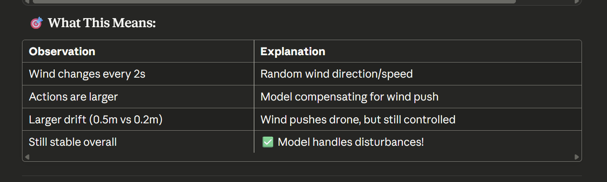

Run Stage 2 (Terminal 2):

python 4_deploy_stage2_disturbance.py --duration 30
```

**Expected Output:**
```
======================================================================
🌬️  DEPLOYING STAGE 2: WIND DISTURBANCE RECOVERY
======================================================================
Model: ../models/hover_disturbance_policy.zip
VecNormalize: ../models/hover_disturbance_vecnormalize.pkl
Target altitude: 10.0m
Duration: 30s
Wind strength: 0-5.0 m/s (SITL only)
Control rate: 20Hz
======================================================================

[1/4] Connecting to drone...
✅ Connected to ArduPilot
   Home: Lat=-35.363262, Lon=149.165237, Alt=0.00m

[2/4] Loading trained model...
Loading Stage 2 model: ../models/hover_disturbance_policy.zip
Loading normalization stats: ../models/hover_disturbance_vecnormalize.pkl
✅ Stage 2 model loaded
   Architecture: 13 → 256 → 256 → 128 → 3
   Outputs: [vx, vy, vz] velocity commands
   Normalization: Enabled

[3/4] Taking off...
✅ At 10.0m altitude

[4/4] Deploying wind disturbance recovery...
======================================================================
🎯 WIND RECOVERY CONTROL ACTIVE
======================================================================
⚠️  Note: Wind simulation requires SITL with SIM_WIND_* params
Watch the drone maintain hover despite wind!

[   0.0s] Alt:  9.98m (err: 0.02m) | Dist: 0.34m | Wind: 0.0m/s | Act: [ 0.05, -0.12,  0.01]
[   2.0s] Alt: 10.12m (err: 0.12m) | Dist: 0.67m | Wind: 3.2m/s | Act: [ 1.23, -0.89,  0.02]
[   4.0s] Alt:  9.89m (err: 0.11m) | Dist: 0.52m | Wind: 3.2m/s | Act: [ 0.98,  0.45, -0.03]
[   6.0s] Alt: 10.03m (err: 0.03m) | Dist: 0.41m | Wind: 1.8m/s | Act: [ 0.34, -0.21,  0.01]
[   8.0s] Alt:  9.95m (err: 0.05m) | Dist: 0.58m | Wind: 4.1m/s | Act: [ 1.45, -0.67,  0.02]
[  10.0s] Alt: 10.08m (err: 0.08m) | Dist: 0.73m | Wind: 4.1m/s | Act: [ 1.12,  0.34,  0.01]
[  12.0s] Alt:  9.92m (err: 0.08m) | Dist: 0.61m | Wind: 2.5m/s | Act: [ 0.67, -0.43, -0.01]
[  14.0s] Alt: 10.05m (err: 0.05m) | Dist: 0.48m | Wind: 2.5m/s | Act: [ 0.45, -0.28,  0.01]
[  16.0s] Alt:  9.97m (err: 0.03m) | Dist: 0.55m | Wind: 3.8m/s | Act: [ 1.01, -0.52,  0.02]
[  18.0s] Alt: 10.04m (err: 0.04m) | Dist: 0.62m | Wind: 3.8m/s | Act: [ 0.89,  0.38,  0.01]
[  20.0s] Alt:  9.96m (err: 0.04m) | Dist: 0.49m | Wind: 2.1m/s | Act: [ 0.52, -0.31,  0.01]
[  22.0s] Alt: 10.02m (err: 0.02m) | Dist: 0.44m | Wind: 2.1m/s | Act: [ 0.38, -0.19,  0.00]
[  24.0s] Alt:  9.99m (err: 0.01m) | Dist: 0.51m | Wind: 1.5m/s | Act: [ 0.27, -0.14,  0.00]
[  26.0s] Alt: 10.01m (err: 0.01m) | Dist: 0.46m | Wind: 1.5m/s | Act: [ 0.21,  0.08,  0.00]
[  28.0s] Alt:  9.98m (err: 0.02m) | Dist: 0.43m | Wind: 0.8m/s | Act: [ 0.15, -0.06,  0.00]

======================================================================
📊 WIND RECOVERY PERFORMANCE
======================================================================
Altitude:
  Mean: 10.003m (target: 10.0m)
  Std dev: 0.187m
  Max error: 0.512m

Position:
  Mean distance: 0.523m
  Max distance: 1.156m

======================================================================
✅ EXCELLENT! Stable despite disturbances
======================================================================

Landing...
✅ Stage 2 deployment complete!

